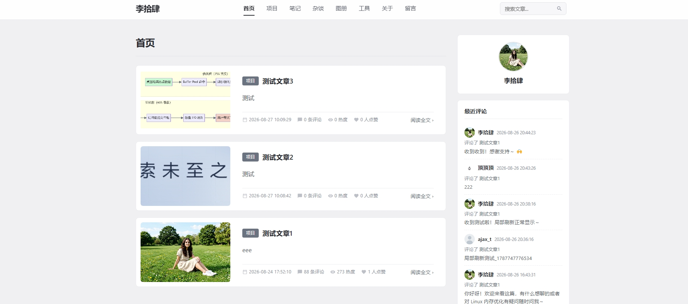
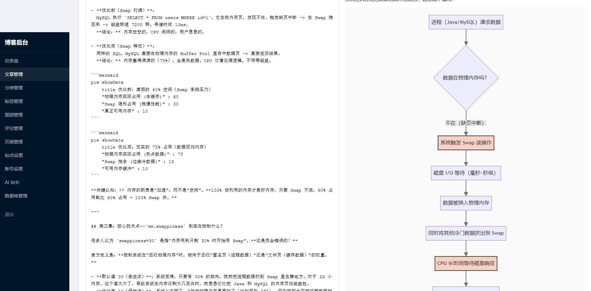
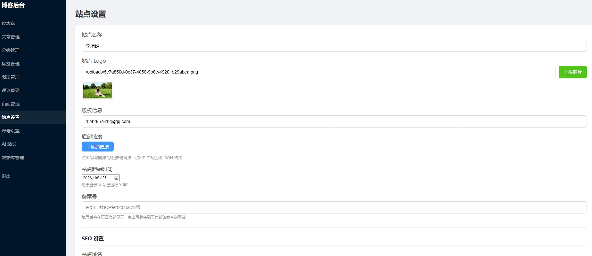
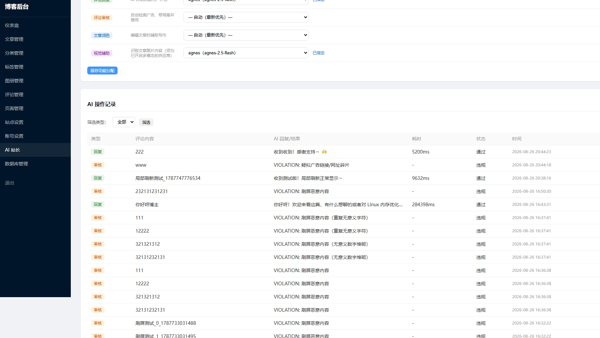
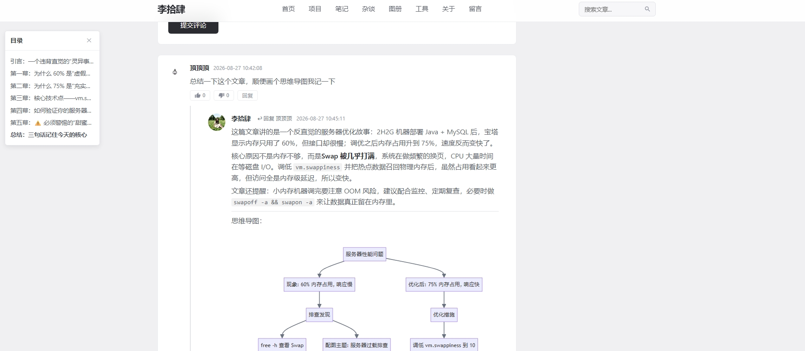

# 李拾肆博客 (leeshisi-blog)

> **在线地址：[https://leeshisi.cn](https://leeshisi.cn)**

一个轻量化的个人技术博客系统，支持文章发布（Markdown）、图册管理、访客评论、文章评分/点赞、评论投票、图片上传（本地/七牛云可选）、账号设置、搜索、归档、工具集、Mermaid 图表渲染、AI 站长（AI 自动回复评论/内容审核/文章润色）等功能。基于 Node.js + Express + SQLite 构建。

## 技术栈

| 层级 | 技术 |
|------|------|
| 运行时 | Node.js 20+（推荐 22 / 24 LTS） |
| Web 框架 | Express 4.x |
| 模板引擎 | EJS + express-ejs-layouts |
| 数据库 | SQLite（sql.js WASM 驱动，无原生依赖） |
| 会话管理 | express-session + connect-sqlite3 |
| Markdown 渲染 | marked |
| 代码高亮 | highlight.js |
| XSS 过滤 | DOMPurify + jsdom |
| AI 集成 | OpenAI 兼容 API（DeepSeek / 智谱 GLM / OpenAI / Moonshot / 通义千问等）、Tavily 联网搜索 |
| 密码加密 | bcryptjs |
| 图片上传 | multer（本地）/ qiniu（七牛云可选） |
| 图表渲染 | Mermaid.js 10（饼图、流程图、时序图等） |

## 功能特性

- **内容发布** — Markdown 文章、图册管理、静态页面（关于/留言），支持图片上传（本地存储或七牛云）
- **多分类系统** — 首页、项目、笔记、杂谈、图册
- **标签系统** — 标签云、文章-标签关联
- **访客评论** — 无需登录即可评论，支持回复、审核管理、点赞/踩（按 IP 去重），QQ 邮箱自动填充昵称/头像，昵称保护（不可与博主昵称重合，前后端双重校验）
- **评论风控** — 单 IP 评论频率限制、频繁触发自动拉黑（IP 级黑名单，持久化）、每日 AI 审核/回复配额（防 token 被刷爆）
- **评论分页** — 一级评论加载更多（每页 10 条），每条一级评论下的回复默认显示最新 5 条、可展开剩余回复
- **文章评分** — 五星评分，按 IP 去重
- **文章点赞** — 按 IP 去重，防止刷赞
- **搜索** — 文章全文搜索
- **侧边栏** — 作者信息（可自定义头像/昵称）、最近评论、热门文章、归档、标签云、运行时间
- **Mermaid 图表** — 文章/页面/评论区支持饼图、流程图、时序图、类图等渲染
- **工具集** — 内置在线工具（图片极限压缩等），支持扩展
- **AI 站长** — 接入 OpenAI 兼容 AI（DeepSeek/GLM/OpenAI/Moonshot/千问/自定义），实现评论自动回复、评论审核、文章润色、视觉辅助、Tavily 联网搜索，含操作记录与每日配额/风控
- **管理后台** — 仪表盘、文章/分类/标签/图册/评论/页面管理、站点设置（站点名称/Logo/备案号/七牛云配置）、账号设置（头像上传/昵称/邮箱/密码修改）、AI 站长配置、数据库管理
- **站点定制** — 站点名称、Logo（favicon）、备案号、友情链接、版权信息全部可后台配置

## 界面预览

- **前台首页**：
- **管理后台**：
- **站点设置**（自定义站点名称/Logo 等）：
- **AI 站长审核/回复记录**：
- **AI 回复用户评论并生成思维导图**：

## 快速开始

### 前置条件

- Node.js 20+（DOMPurify 3.3.2+ 要求 Node ≥20）
- npm

### 安装与运行

```bash
# 克隆项目
git clone https://github.com/your-username/leeshisi-blog.git
cd leeshisi-blog

# 安装依赖
npm install

# 启动服务（默认端口 3000）
npm start
```

服务启动后访问 `http://localhost:3000`。

## AI 站长

管理后台新增「AI 站长」菜单（`/admin/ai`），可将 OpenAI 兼容的 AI 接入博客，自动处理评论与辅助写作。

### 支持的供应商（可预填）

| 供应商 | 默认 API URL |
|--------|-------------|
| DeepSeek | `https://api.deepseek.com/v1` |
| 智谱 GLM | `https://open.bigmodel.cn/api/paas/v4` |
| OpenAI | `https://api.openai.com/v1` |
| Moonshot | `https://api.moonshot.cn/v1` |
| 通义千问 | `https://dashscope.aliyuncs.com/compatible-mode/v1` |
| 自定义 | 任意 OpenAI 兼容端点 |

选择供应商后可跳转其官网获取 API Key。同时支持配置模型 ID、是否多模态模型，并为不同功能（评论回复/评论审核/文章润色/视觉辅助）各自指定所用的 AI。

### 可用功能

- **评论自动回复** — 评论后 AI 自动回复；用户回复 AI 时结合文章与对话历史继续交流（用户间回复不触发 AI）。由多步规划的 Agent 循环驱动（默认 10 轮、超时 5~10 分钟），可静默调用工具获取信息，不向用户暴露工具。
- **评论审核（批量）** — 自动识别广告、辱骂、违法等违规内容，命中即禁用（可恢复）。未审核评论按间隔合并为一次 AI 调用统一审核，省 token。
- **文章润色** — 编辑时「AI 润色」一键生成文本，经左右对比确认后替换正文。

### 内置工具（Agent 可按需调用）

| 工具 | 作用 | 依赖 |
|------|------|------|
| `get_article_text` | 按区间读取文章正文，返回该段 + 总字数/图片数/图片清单 | 文章上下文 |
| `get_article_image` | 拼接图片绝对 URL、校验公网可访问，并用「视觉辅助」模型识别图片内容 | 文章上下文 + 已配置视觉辅助 |
| `web_search` | 基于 Tavily 联网搜索，获取准确/最新信息 | 已配置 MCP（Tavily） |
| `web_extract` | 基于 Tavily 提取指定 URL 的正文内容（常与 `web_search` 搭配） | 已配置 MCP（Tavily） |

工具被封装在 `tools/` 目录，每个工具都是一个独立模块（含 `name`/`description`/`parameters`/`run`），新增工具只需在 `tools/` 下新建文件即可自动注册。

### 视觉辅助（多模态）

将「功能分配」中的「视觉辅助」设为多模态模型后，`get_article_image` 可真正"看图"并返回内容描述。未配置时该工具仅返回提示，不影响其它功能。图片地址兼容本地相对路径、七牛云 CDN 与外部 https。

### MCP（Tavily 联网搜索）

在 `/admin/ai → MCP 配置` 填入 Tavily API Key 保存（先测连通性），启用后 AI 在需要准确/实时信息时自动联网搜索并提取网页内容。

### 评论 AI 防护（防 token 被刷爆）

针对"评论可无限刷空 token"的短板，后台「评论 AI 防护」面板提供：

- **每日配额** — 设定每日最大 AI 审核/回复条数，跨天自动清零，超限则当天不再自动审核/回复
- **批量审核** — 未审核评论按间隔（默认 1 分钟）合并为一次 AI 调用统一审核省 token
- **频率限制** — 每分钟单 IP 最大评论条数（默认 3），超限提示「发言频繁，请稍后」
- **IP 黑名单** — 频繁触发限流达到阈值（默认 30 次）自动拉黑该 IP 一段时间（默认 1 小时，持久化存储）

### 初始化管理员

服务启动后，系统会自动创建默认管理员账号（仅首次）：

- 邮箱：`admin@blog.com`
- 密码：`admin123`

前往 `http://localhost:3000/admin/login` 登录管理后台。

## 项目结构

```
├── app.js                 # 应用入口
├── config/                # 数据库配置
├── controllers/           # 控制器
│   ├── adminController.js     # 管理后台（文章/分类/标签/图册/评论/页面/设置/账号）
│   ├── articleController.js   # 文章（首页/分类/标签/搜索/评分/点赞）
│   ├── commentController.js   # 评论（发表/点赞/踩/加载更多）
│   ├── aiController.js        # AI 站长（配置/操作记录/文章润色）
│   ├── pageController.js      # 页面（关于/留言/图册/API）
│   ├── toolController.js      # 工具（图片压缩等）
│   └── uploadController.js    # 图片上传
├── middleware/            # 中间件（认证、公共数据）
├── models/                # 数据模型
│   ├── comment.js             # 评论模型（含按根评论分页加载子回复）
│   ├── ai.js                  # AI 模型（配置 / 批量审核 / Agent 工具循环 / 回复 / 润色 / 配额）
│   └── ...
├── services/             # 后台服务
│   ├── aiScheduler.js           # AI 评论批量审核/回复调度
│   └── commentRateLimiter.js     # 评论频率限制 + IP 拉黑
├── tools/                # Agent 工具（每个工具一个模块，自动注册）
│   ├── article-text.js          # 按需读取文章正文
│   ├── article-image.js         # 校验/识别文章图片
│   ├── web-search.js            # Tavily 联网搜索
│   └── web-extract.js           # Tavily URL 内容提取
├── routes/                # 路由
│   ├── admin.js               # 管理后台路由
│   ├── index.js               # 前端路由
│   └── upload.js              # 上传路由
├── utils/                 # 工具（Markdown 渲染 + DOMPurify 安全过滤）
├── views/                 # 视图模板（EJS）
│   ├── partials/          # 公共组件（导航、侧边栏、页脚）
│   ├── admin/             # 管理后台视图（含 ai-settings.ejs）
│   ├── _comment-item.ejs      # 评论项模板（两级渲染）
│   ├── _comment-fragment.ejs  # 评论片段模板（AJAX 加载更多）
│   ├── tools.ejs          # 工具列表页
│   └── tools-image-compress.ejs  # 图片压缩工具页
├── public/                # 静态资源（CSS/JS/图片/上传目录）
└── data/                  # SQLite 数据库文件（blog.db）
```

## 部署

### 使用 PM2 进程管理（推荐）

```bash
npm install -g pm2
pm2 start app.js --name leeshisi-blog
pm2 save
pm2 startup
```

### Nginx 反向代理配置示例

```nginx
server {
    listen 80;
    server_name your-domain.com;

    location / {
        proxy_pass http://127.0.0.1:3000;
        proxy_set_header Host $host;
        proxy_set_header X-Real-IP $remote_addr;
        proxy_set_header X-Forwarded-For $proxy_add_x_forwarded_for;
    }
}
```

## 数据备份

建议定期备份 `data/blog.db` 文件，以保护文章、评论、用户数据。

## 支持一下 

这个博客及其中所有功能完全免费、开源。如果你觉得有帮助，欢迎自愿支持一下，感谢你的心意 ❤️

|  |  |
|------|--------|
|  |  |

> 支持纯属自愿，金额随意，谢谢每一位心意。

## 许可证

MIT
